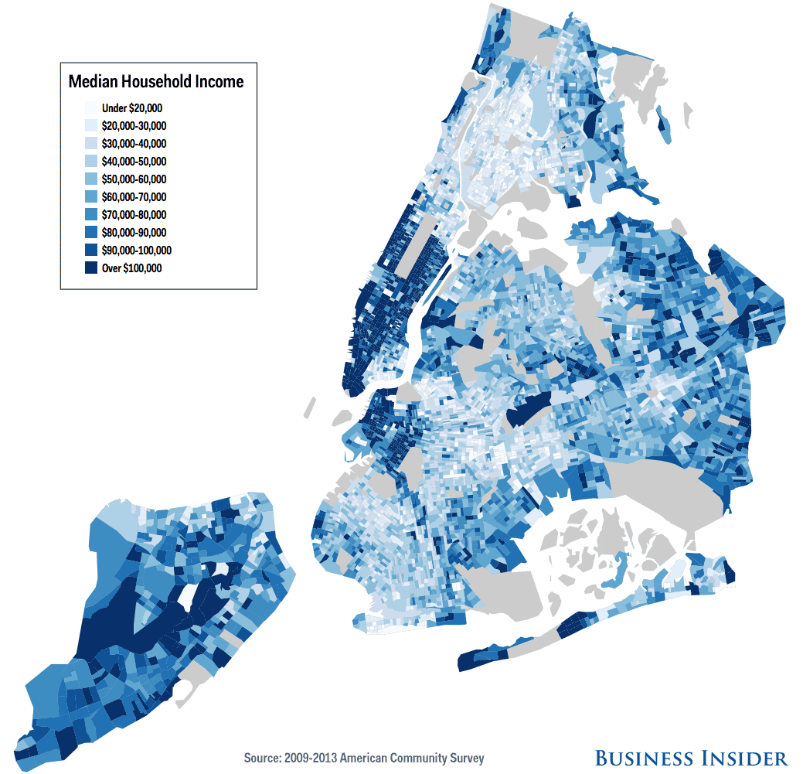

# Results

---
output:
  html_document:
    code_folding: hide
---


```{r setup, include=FALSE}
knitr::opts_chunk$set(echo = TRUE)
```

```{r}
library(tidyverse)
library(sf)
library(tmap)
library(dplyr)
library(lubridate) 
library(ggplot2)
library(vcd)
library(readxl)
library(patchwork)
library(ggmap)
library(leaflet)

#get the data directly from the original source.

df_2021 <-read.csv("/Users/liyiming/TaxiNYC/dataset/2021_Yellow_Taxi_Trip_Data__Jan-Jul_.csv")

set.seed(0)
sample_2021<-sample_n(df_2021,1000000,replace = FALSE)


```

At beginning, I will do some data analysis for the basic information of Yellow Taxi Trip
dataset (Jan-July 2021) to get some insights about the distribution of pick-up locations and
the distribution of pick-up time in a day.


```{r}

shape <-read_sf("/Users/liyiming/TaxiNYC/dataset/taxi_zones/taxi_zones.shp")


graph_df<- as.data.frame(table(df_2021["PULocationID"]))
names(graph_df)[names(graph_df) =="Var1"] <-"LocationID"
names(graph_df)[names(graph_df) =="Freq"] <-"pick-ups"


sequence2 <-c(1:263)
index<-sequence2[1:263%in% graph_df$LocationID]
shape<-shape[index,]
graph_df<-graph_df[-c(251,252),]
graph_df$LocationID<-as.numeric(graph_df$LocationID)
df.2021<-left_join(shape,graph_df)

tm_shape(df.2021) +
  tm_polygons("pick-ups", palette = "Blues")+
   tm_text("LocationID", size = .2)
```

*There are so missing areas for pick-ups data, that's because I did a random 
sampling for the original dataset so there might be some records that the sampling
dataset didn't catch and either the original/sampling dataset doesn't contain 
NAs.

From this map, We can see that most of the pick-up services of Yellow Taxi are
concentrated in Manhattan area and several areas in Brooklyn and Queens. Very less 
pick-ups occured in the place like Staten Island and Bronx area. What cause the 
sparse distribution of pick-ups in certain areas? I will mainly focus on two factors:
the income level(from the passenger perspective) and crime rate(from the driver 
perspective) of certain areas.




Intuitively speaking, there tend to be fewer Taxi pick-ups in low-income areas
because the fare of Taxi is extremely high compared to most of the cities in United
States.

According to the data of US Census Bureau in 2013, 56% of the population of New York 
City uses the public transportation system. So hailing a Taxi seems like a thing for
special occasions for most of people living in NYC. As I mentioned earlier, the fare
of Taxi in NYC is extremely high, people who have low income probably won't choose to
take Taxi instead of they will choose public transportation more in their life since 
NYC has one of the largest public transportation systems around the world, so they can
easily hop on a train/bus to the place they want to go rather than paying the extra money.
In the comparison with high-income households, people are more likely to choose take a Taxi
since the time costs for waiting subway/bus etc are much more higher than the money 
they spent on taking a Taxi.

So in here, I attached the "NYC median household income distribution map" from Business 
Insider as a reference. In this income distribution map, We can see the household with high income 
located mainly at Manhattan,the border part of Brooklyn and Queens areas, little part 
inside Brooklyn and Staten Island.And the most low-income households concentrated at
Bronx area, middle and lower part of Brooklyn. Compare the pick-up distribution map 
and income map, they basically follow the similar pattern: low-income area, low pick-ups. 
high-income area, high pick-ups. 

However, We can't see this kind of relationship exists in the grey areas of the income map,
because these grey areas are nonresidential neighborhoods, for example, the lower
part of Brooklyn is Gateway National Recreation Area and the lower part of Queens is 
John F.Kennedy International Airport, so that's why there are still a large number of
pick-ups recorded for these areas even though they don't follow the relationship
with the income factor.And the other counterintuitive finding from the "distribution
of pick-ups map" is that even though the median income of household in Staten Island is
pretty high, the pick-ups is quite low. According to the "New York City Car Ownership Rates"
data by NYCEDC in 2018, around 83% of all households in Staten Island owns a car and the 
ownership of a car is lowest in Manhattan(only 22% of households own a car). To some extent,
this data probably can explain why there are low pick-ups in Staten Island and high
pick-ups in Manhattan from another perspective.


```{r}

smpldata<- as.factor(sample_2021$tpep_pickup_datetime)
smpltime <-dmy_hm(as.character(smpldata))
sample_2021$hour <-hour(smpltime)

hour <-table(sample_2021$hour)
hist(sample_2021$hour, main="Distribution of pickup hours",xlab="pick up time",ylab="taxi pick ups"
     ,xlim=c(0,24),col="light blue")

```

From the distribution of pick-ups for different time in a day, We can see that 
Taxi are available 24 hours a day. The peak hours for Taxi pick-ups are from 17:00
to 18:00, that's probably a lot of people getting off work during that time period.
And we can see the pick-ups steadily rises from 5am (that's probably because a lot of
people are getting up for the works during that time) until it hits the peak and
then pick-ups drop until it hits another peak at 12am(some people finished their night
shifts,going to the airport/night club/party etc, there are a lot of reasons to
explain where there is a pick-up peak at 12am). Very less pick-ups in the midnight,
because most of people are in the sleep during that time period. So in this graph,
there is no counterintuitive finding. 
  


```{r}


taxi5<-read_csv("https://s3.amazonaws.com/nyc-tlc/trip+data/yellow_tripdata_2014-05.csv")

set.seed(0)
sample_taxi5<-sample_n(taxi5,652435, replace = FALSE)
uber5<-read_csv("https://github.com/fivethirtyeight/uber-tlc-foil-response/raw/master/uber-trip-data/uber-raw-data-may14.csv")

taxi5.h<-as.numeric(format(sample_taxi5$pickup_datetime,'%H'))
uber5.h <-as.POSIXct(uber5$`Date/Time`, format = "%m/%d/%Y %H:%M:%S")
uber5.h<-as.numeric(format(uber5.h, format = "%H"))

taxi5.df<-as.data.frame(table(taxi5.h))
names(taxi5.df)[names(taxi5.df) =="taxi5.h"] <-"Hour"
names(taxi5.df)[names(taxi5.df) =="Freq"] <-"pickups"


uber5.df<-as.data.frame(table(uber5.h))
names(uber5.df)[names(uber5.df) =="uber5.h"] <-"Hour"
names(uber5.df)[names(uber5.df) =="Freq"] <-"pickups"

hour.df<-rbind(taxi5.df,uber5.df)
hour.df$Type[1:24]<-"Taxi"
hour.df$Type[24:48]<-"Uber"

hour.df$Hour<-as.numeric(levels(hour.df$Hour))


ggplot(data=hour.df,aes(x=Hour,y=pickups, color=Type))+
  geom_point()+
  geom_line()+
  labs(x="Hour",title="the distribution of pick-ups by hour")+
  scale_x_discrete(limits=0:23, labels = 0:23)
```

In the graph, I plot the distribution of pick-ups by hour of Taxi and Uber data.
One thing is quite counterintuitive is that we all know the launch of Uber nearly
drove the Taxi companies out of the business. But from this graph, we can see that
the number of Taxi pick-ups is much higher than the number of Uber pick-ups in
several time periods in a day.That's probably because with the increase of demand to
a ride, the price of Uber ride will surge. But Taxi will have a quite stable and 
lower price. People will turn to Taxi if the price of Uber is surging and that's 
probably why during some time period, the number of Taxi pick-ups are much higher
than the Uber pick-ups.

They all follow a similar pick-ups distribution after the morning/evening rush hours
(the number of pick-ups for Uber/Taxi all constantly rises/drops).But the pick-up 
peak of Taxi always lags behind the peak of Uber. We can see that the increase demand 
of Uber pick-up starts at 2am but the increase demand for Taxi pick-up starts at 5am(lag
behind around 3 hours).Uber pick-up hits its first peak at 7am but Taxi pick-up hits
its small peak at 9am. And there are more Uber pick-ups than Taxi pick-ups during the rush
hour, that's probably because people can more easily find a Uber than Taxi since they
have no choice. 
  
  

```{r}
taxi.09<-read_csv("https://s3.amazonaws.com/nyc-tlc/trip+data/yellow_tripdata_2009-01.csv")
taxi.12<-read_csv("https://s3.amazonaws.com/nyc-tlc/trip+data/yellow_tripdata_2012-01.csv")

set.seed(0)
sample09 <-sample_n(taxi.09,1000000, replace = FALSE)
sample12 <-sample_n(taxi.12,1000000, replace = FALSE)


#count the pick-ups trip for each day the same month for year 2009,2012,2015

sample09.d<-format(as.Date(sample09$Trip_Pickup_DateTime,format="%Y-%m-%d"), format = "%d")
sample12.d<-format(as.Date(sample12$pickup_datetime,format="%Y-%m-%d"), format = "%d")

d09<-as.data.frame(table(sample09.d))
names(d09)[names(d09) =="sample09.d"] <-"Day"
d12<-as.data.frame(table(sample12.d))
names(d12)[names(d12) =="sample12.d"] <-"Day"


bind2<-bind_rows(d09, d12)
bind2$Year[1:31]<-"2009"
bind2$Year[32:62]<-"2012"


bind2$Day<-as.numeric(levels(bind2$Day))


ggplot(data=bind2,aes(x=Day,y=Freq, color=Year))+
  geom_point()+
  geom_line()+
  labs(x="Day",y="pick-ups",title="Number of pick-ups by day for January 2009/2012")+
  scale_x_discrete(limits=1:31, labels = 1:31)

```
In 2011, Uber launched in NYC. So in here I want to compare the count of pick-ups
in January 2009(the year before Uber launch) and in the same month of 2012
(the year after Uber launch) to see if the launch of Uber impacted the Taxi business in NYC.
As we can see from this graph, in the first day of January 2012, the pick-ups drops drastically
compared to the same day in 2009.They both have a lot of fluctations, up and downs. At the peak
of 2009 Taxi pick-ups, the pick-ups of 2012 drops, vice versa.But the overall pattern is that
with the launch of Uber, the pick-ups of Taxi decrease.


```{r}

arrest_data<-read_csv("https://data.cityofnewyork.us/api/views/8h9b-rp9u/rows.csv?accessType=DOWNLOAD")
arrest_data<-select(arrest_data,Latitude,Longitude,)
arrest_data<-arrest_data[!is.na(arrest_data$Latitude),]


map.NY<- get_map("New York" , zoom=10)

ggmap(map.NY)+
   geom_point(data=arrest_data, aes(x=Longitude,y=Latitude), color='green',size=0.005,alpha=0.005)+
  theme(axis.ticks = element_blank(), axis.text = element_blank())+
  xlab('')+ylab('')+ ggtitle("NYC Crime Map based on the historical arrest data")+
  theme(plot.title = element_text(size=10))

p1 <-ggmap(map.NY) + 
  geom_point(data=sample_taxi5, aes(x=pickup_longitude,y=pickup_latitude), color='blue',size=0.01,alpha=0.05)+
  theme(axis.ticks = element_blank(), axis.text = element_blank())+
  xlab('')+ylab('')+ ggtitle("The Count of Yellow Taxi Pick-ups for May 2014")+
  theme(plot.title = element_text(size=10))
p2<-ggmap(map.NY) + 
  geom_point(data=uber5, aes(x=Lon,y=Lat), color='red',size=0.01,alpha=0.05)+
  theme(axis.ticks = element_blank(), axis.text = element_blank())+
  xlab('')+ylab('')+ ggtitle("The Count of Uber Pick-ups for May 2014")+
  theme(plot.title = element_text(size=10))


p1+p2


```

In the NYC Crime Map, we can see midtown Manhattan, Harlem, Bronx, Brooklyn and
large area of Queens all have high crime rates. In order to see if the crime 
rate is a factor that influences the pick-up of Uber/Taxi(from driver perspective,
because some drivers might take this factor into consideration when they do the 
pick-up). From the left graph, Yellow Taxi pick-ups are more concentrated in Manhattan
area and there are only few pick-ups in the Bronx area and the middle part of Brooklyn
(areas with higher crime rate). In the right graph, We can see Uber pick-ups are spread out
everywhere even in these high crime rate areas where Taxi drivers won't choose to go often.
So from these findings, Uber drivers might consider this factor less important than the 
Taxi drivers, but to a extent, crime rate of one area is one of the factors that affect
the number of pick-ups in NYC.


```{r}

sample_2021<-sample_2021[!sample_2021$tip_amount<0,]

sample_2021$tip.percent <-round(sample_2021$tip_amount/sample_2021$total_amount,2)
sample_2021$tip.categories <-cut(sample_2021$tip.percent, breaks=c(0,0.1,0.2,Inf),labels=c("low tips","medium tips","high tips"),include.lowest = TRUE)

sample_2021$tip.categories <-as.factor(sample_2021$tip.categories)
sample_2021<-sample_2021[!is.na(sample_2021$tip.categories)==TRUE,]

ggplot(sample_2021, aes(payment_type,fill=tip.categories))+
  geom_bar(position="stack")+ xlab("payment type")+ylab("count")+
  ggtitle("the distribution of tip categories over different payment type", 
          subtitle = "1= Credit Card 2= Cash 3= No Charge 4= Dispute")+
  coord_flip()


```

In order to see the possible factors that affect the tipping behavior of passengers,
I am ploting the distribution of tip categories over different payment method.
In our data, We have four types of payment type: credit card, cash, no charge and dispute.
From the graph, We can see that when the payment type is credit card, the passengers give
tips in a various range from low to high and in the most situations they can get tips.
But if the payment type is cash, there are only few tips data recorded, this doesn't mean
that people who pay in cash won't give a good tip, that's probably because the data of tip
in cash didn't state in the data. So from the graph, this payment type method can't help us
draw a persuasive conclusion that there exists a clear relationship between the tips and payment 
type because there are lot of missing data.


```{r}

ggplot(sample_2021,aes(hour,fill=tip.categories))+ 
geom_bar(position ="stack") +  
xlab("pick up time")+ylab("count")+ggtitle("the distribution of tip categories over different pick-up time period") + coord_flip()

```


In this graph, besides considering the payment type as a factor that affect the tipping 
behavior of passengers, We want to see if the pick-up time in a day can be one of these
factors. Passengers tend to give generous tips during the evening rush hours(5pm-7pm).
And in the early morning and late night, passengers tend to give low tips.


```{r}
map.cu<- get_map(location = c(lon =-73.963036, lat =40.807384) , zoom=17)
lon =c(-73.9640,-73.963036)
lat =c(40.8069,40.8095)
taxi.pickup <- sample12 %>%
  filter(pickup_longitude > lon[1] & pickup_longitude < lon[2],
         pickup_latitude > lat[1] & pickup_latitude < lat[2]) 

ggmap(map.cu) + 
  geom_point(data=taxi.pickup,
             aes(x=pickup_longitude,y=pickup_latitude),size=.03,alpha=0.3,color="red")+
  ggtitle('Taxi Pickups near Columbia University')

ny.map <- get_map("Central Park, New York, NY", color="bw",zoom=11)
 ggmap(ny.map) + 
  geom_point(data=taxi.pickup,
             aes(x=pickup_longitude,y=pickup_latitude),size=.5,alpha=0.5,color="red")+
  geom_point(data=taxi.pickup, aes(x=dropoff_longitude,y=dropoff_latitude), color="blue",size=0.5,alpha=0.5)+
  ggtitle('Taxi Dropoffs from Columbia University in Blue')


```


I first plot the Taxi pick-ups near Columbia University and then plot the dropoff
locations of these pick-ups in order to see where the people go from Columbia University.
Since I only plot the pick-ups around Columbia University and Banard College, so I am
thinking the most of these pick-up rides are probably requested by Columbia and Banard 
students. And maybe the drop-off locations of these rides can act as an indicator about where
the students attend Columbia and Banard live.

In the Taxi dropoffs map, We can see that the most of rides ended at Upper East Side
Upper West Side and the areas that are close to the schools.Few dropoff locations are at
Booklyn and the rest areas in Manhattan, such as West Village and Tribeca.If this is
an indicator about where the students attend Columbia and Banard live, it actually makes a
lot of sense since students prefer to live in the places that are close to the school so that
they won't waste a lot of time on the commute. And we can see it from the graph, there are 
very few people go to the places(like Brooklyn) that are far away from school by Taxi.


```